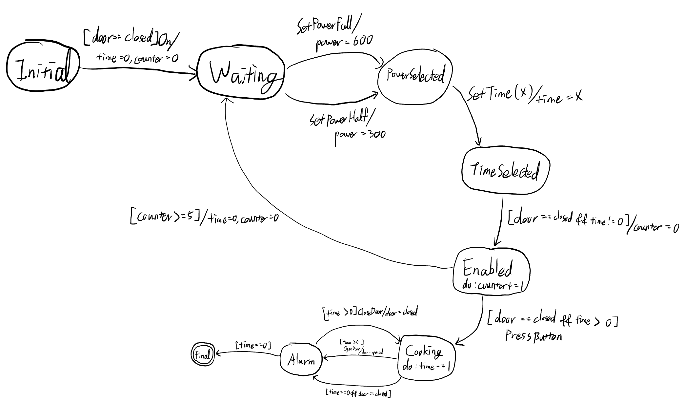

# Assignment: Model-based Test Generation

## Functional Requirements: Microwave controller

* 전원을 켜면 시간을 디스플레이하고 사용자의 입력을 기다리며 대기한다
    * 문이 열려 있는 상태에서는 전원이 켜지지 않는다

* 전자레인지 power 의 강도는 Full, 과 Half 두가지 옵션이 있다
    * Full power = 600
    * Half power = 300

* 사용자는 power 의 강도를 선택한 후, 작동 시간을 초 단위로 지정할 수 있다.
    * 작동 시간 지정 범위는 1 초에서 60 초 사이로 가정한다

* Power 강도와 작동시간이 지정되었고 문이 닫혀 있으면 작동 버튼이 활성화된다.
* 활성화된 작동 버튼을 누르면, 지정된 강도로 지정된 시간동안 작동한다
    * 활성화된 상태에서 5 초이상 버튼을 누르지 않으면 power 강도와 작동시간 설정이 모두 초기화된다.

* 작동 중 문이 열리면 즉시 작동을 중단하고 알람을 울린다
* 작동이 끝나면 power 강도와 작동시간 설정을 초기화 하고 작동 끝을 알리는 알람을 울린다


## To Do

1. Model the requirements in Finite State Machine

2. Write a NuSMV model from the FSM
    a. The model must satisfy the following properties
        i. 문이 열려있을 때에는 결코 작동되지 않는다
        ii. Full power 로 작동이 시작되면 끝났을 때에도 Full power 로 끝난다
        iii. Half power 로 작동이 시간되면 끝났을 때에도 half power 로 끝난다

3. Generate test cases from the NuSMV using transition coverage criteria


## Submit

1. FSM model (Graphical)

2. NuSMV model (with LTL properties for 100% transition coverage)

3. Test cases and coverage analysis report

4. Proof that your model satisfies essential properties.


### Due: 2023.05.22 1pm


---


# Report

## 1. FSM model (Graphical)



## 2. NuSMV model (with LTL properties for 100% transition coverage)

```
-- Microwave.smv
MODULE main
  VAR
    state: {Initial, Waiting, PowerSelected, TimeSelected, Enabled, Cooking, Alarm, Final};
    event: {NONE, On, Off, OpenDoor, CloseDoor, SetPowerFull, SetPowerHalf, SetTime, PressButton, Complete};
    power: {300, 600};
    door: {Closed, Opened};
    time: 0..60;
    counter: 0..6;

  DEFINE
    Full:= 600;
    Half:= 300;

  ASSIGN
    init(counter):= 0;
    init(time):= 0;
    init(state):= Initial;
    init(event):= NONE;

    next(state):= case
        state = Initial & door = Closed & event = On    : Waiting;
        state = Waiting & event = SetPowerFull  : PowerSelected;
        state = Waiting & event = SetPowerHalf  : PowerSelected;
        state = PowerSelected & event = SetTime : TimeSelected;
        state = TimeSelected & door = Closed & time > 0 : Enabled;
        state = Enabled & door = Closed & time > 0 & counter < 5 & event = PressButton  : Cooking;
        state = Enabled & counter >= 5  : Waiting;
        state = Cooking & time = 0 & door = Closed  : Alarm;
        state = Cooking & event = OpenDoor & time > 0   : Alarm;
        state = Alarm & time > 0 & event = CloseDoor    : Cooking;
        state = Alarm & time = 0    : Final;
        TRUE                : state;
    esac;

    next(power):= case
        state = Waiting & event = SetPowerFull  : Full;
        state = Waiting & event = SetPowerHalf  : Half;
        state = Enabled & counter >= 5          : {300, 600};
        TRUE                                    : power;
        esac;

    next(time):= case
        state = Initial & event = On & door = Closed    : 0;
        state = PowerSelected & event = SetTime         : 1..60;
        state = Enabled & counter >= 5                  : 0;
        state = Cooking & time > 0                      : time -1;
        TRUE                                            : time;
    esac;

    next(counter):= case
        counter +1 > 5                                  : counter;
        state = Initial & event = On & door = Closed    : 0;
        state = TimeSelected & door = Closed & time > 0 : 0;
        state = Enabled & counter < 5                   : counter +1;
        TRUE                                            : counter;
    esac;

    next(door):= case
        event = OpenDoor    : Opened;
        event = CloseDoor   : Closed;
        TRUE                : door;
    esac;


-- 3. transition coverage criteria
LTLSPEC G(state = Initial & door = Closed & event = On -> !X(state = Waiting))  -- Initial -> Waiting
LTLSPEC G(state = Waiting & (event = SetPowerFull | event = SetPowerHalf) -> !X(state = PowerSelected))  -- Waiting -> PowerSelected
LTLSPEC G(state = PowerSelected & event = SetTime -> !X(state = TimeSelected))  -- PowerSelected -> TimeSelected
LTLSPEC G(state = TimeSelected & door = Closed & time > 0 -> !X(state = Enabled))  -- TimeSelected -> Enabled
LTLSPEC G(state = Enabled & door = Closed & time > 0 & counter < 5 & event = PressButton -> !X(state = Cooking))  -- Enabled -> Cooking
LTLSPEC G(state = Enabled & counter >= 5 -> !X(state = Waiting))  -- Enabled -> Waiting
LTLSPEC G(state = Cooking & time = 0 & door = Closed -> !X(state = Alarm))  -- Cooking -> Alarm  (Cooking Complete)
LTLSPEC G(state = Cooking & event = OpenDoor & time > 0 -> !X(state = Alarm))  -- Cooking -> Alarm (Door Opened)
LTLSPEC G(state = Alarm & time > 0 & event = CloseDoor -> !X(state = Cooking))  -- Alarm -> Cooking
LTLSPEC G(state = Alarm & time = 0 -> !X(state = Final))  -- Alarm -> Final


-- 4. proof that the model satisfies essential properties
-- i. It never works(cooks) when the door is open
LTLSPEC G(state != Cooking | door != Opened)
-- ii. When Cooking state starts in Full power, it ends in Full power
LTLSPEC G((state = Cooking & power = Full) -> (state = Final -> power = Full))
-- iii. When Cooking state starts in Half power, it ends in Half power
LTLSPEC G((state = Cooking & power = Half) -> (state = Final -> power = Half))
```

이 코드는 파일 별도 첨부하였습니다.


## 3. Test cases and coverage analysis report

### LTL specs from transition coverage criteria

```
**** PROPERTY LIST [ Type, Status, Counter-example Number, Name ] ****
--------------------------  PROPERTY LIST  -------------------------
000 : G ((state = Initial & door = Closed & event = On) -> !( X state = Waiting)) 
  [LTL            False          1      N/A]
001 : G ((state = Waiting & (event = SetPowerFull | event = SetPowerHalf)) -> !( X state = PowerSelected)) 
  [LTL            False          2      N/A]
002 : G ((state = PowerSelected & event = SetTime) -> !( X state = TimeSelected)) 
  [LTL            False          3      N/A]
003 : G ((state = TimeSelected & door = Closed & time > 0) -> !( X state = Enabled)) 
  [LTL            False          4      N/A]
004 : G ((state = Enabled & door = Closed & time > 0 & counter < 5 & event = PressButton) -> !( X state = Cooking)) 
  [LTL            False          5      N/A]
005 : G ((state = Enabled & counter >= 5) -> !( X state = Waiting)) 
  [LTL            False          6      N/A]
006 : G ((state = Cooking & time = 0 & door = Closed) -> !( X state = Alarm)) 
  [LTL            False          7      N/A]
007 : G ((state = Cooking & event = OpenDoor & time > 0) -> !( X state = Alarm)) 
  [LTL            False          8      N/A]
008 : G ((state = Alarm & time > 0 & event = CloseDoor) -> !( X state = Cooking)) 
  [LTL            False          9      N/A]
009 : G ((state = Alarm & time = 0) -> !( X state = Final)) 
  [LTL            False          10     N/A]
010 : G (state != Cooking | door != Opened) 
  [LTL            True           N/A    N/A]
011 : G ((state = Cooking & power = Full) -> (state = Final -> power = Full)) 
  [LTL            True           N/A    N/A]
012 : G ((state = Cooking & power = Half) -> (state = Final -> power = Half)) 
  [LTL            True           N/A    N/A]
```

 이후 `Counterexample`분석은 상기 인덱스 기준으로 분석하였습니다.


### Analysis

#### 000 : G ((state = Initial & door = Closed & event = On) -> !( X state = Waiting)) 

```
000 : G ((state = Initial & door = Closed & event = On) -> !( X state = Waiting)) 
  [LTL            False          1      N/A]
```

 우선 이 LTL spec은 `Initial` 상태에서 다음 상태가 `Waiting` 상태에 도달하지 않도록 명시하고 있습니다. 즉, 정상적으로 transition이 연결되었다면 결과로 `false`가 나와야 합니다.


```
-- specification  G ((state = Initial & door = Closed & event = On) -> !( X state = Waiting))  is false
-- as demonstrated by the following execution sequence
Trace Description: LTL Counterexample 
Trace Type: Counterexample 
  -> State: 1.1 <-
    state = Initial
    event = NONE
    power = 300
    door = Closed
    time = 0
    counter = 0
    Half = 300
    Full = 600
  -> State: 1.2 <-
    event = On
  -- Loop starts here
  -> State: 1.3 <-
    state = Waiting
    event = OpenDoor
  -> State: 1.4 <-
    event = CloseDoor
    door = Opened
  -> State: 1.5 <-
    event = OpenDoor
    door = Closed
```

 이 `Counterexample`에선 `Trace`가 `State: 1.2`에서 `door == Closed`일 때, `On`이벤트를 통해 `Waiting`상태가 되었으므로 transition이 정상적으로 연결되었다고 할 수 있다.


#### 001 : G ((state = Waiting & (event = SetPowerFull | event = SetPowerHalf)) -> !( X state = PowerSelected)) 

```
001 : G ((state = Waiting & (event = SetPowerFull | event = SetPowerHalf)) -> !( X state = PowerSelected)) 
  [LTL            False          2      N/A]
```

 이 LTL spec은 `Waiting` 상태에서 `power`를 설정하였을 때,  `PowerSelected` 상태에 도달하지 않도록 명시하고 있습니다. 따라서 이 모델에서 정상적으로 transition이 연결되었다면 결과로 `false`가 나와야 합니다.


```
-- specification  G ((state = Waiting & (event = SetPowerFull | event = SetPowerHalf)) -> !( X state = PowerSelected))  is false
-- as demonstrated by the following execution sequence
Trace Description: LTL Counterexample 
Trace Type: Counterexample 
  -> State: 2.1 <-
    state = Initial
    event = NONE
    power = 300
    door = Closed
    time = 0
    counter = 0
    Half = 300
    Full = 600
  -> State: 2.2 <-
    event = On
  -> State: 2.3 <-
    state = Waiting
    event = SetPowerFull
  -- Loop starts here
  -> State: 2.4 <-
    state = PowerSelected
    event = OpenDoor
    power = 600
  -> State: 2.5 <-
    event = CloseDoor
    door = Opened
  -> State: 2.6 <-
    event = OpenDoor
    door = Closed
```

 `State: 2.3`에서 상태가 `Waiting`이였는데 `SetPowerFull`이벤트를 통해 `State: 2.4`에서 `power`가 `Full`로 설정되었고, 이를 통해 `State: 2.4`에서 상태가 `PowerSelected`가 되었습니다. 이를 통해 `Waiting` 상태에서 `power` 설정하였을 때,  `PowerSelected` 상태에 도달하는 transition이 성립하는 것을 알 수 있습니다.


#### 002 : G ((state = PowerSelected & event = SetTime) -> !( X state = TimeSelected)) 

```
002 : G ((state = PowerSelected & event = SetTime) -> !( X state = TimeSelected)) 
  [LTL            False          3      N/A]
```

 이 LTL spec은 `PowerSelected` 상태에서 `TimeSelected` 상태에 도달하지 않도록 명시하고 있습니다. 따라서 이 모델에서 정상적으로 transition이 연결되었다면 결과로 `false`가 나와야 합니다.


```
-- specification  G ((state = PowerSelected & event = SetTime) -> !( X state = TimeSelected))  is false
-- as demonstrated by the following execution sequence
Trace Description: LTL Counterexample 
Trace Type: Counterexample 
  -> State: 3.1 <-
    state = Initial
    event = NONE
    power = 300
    door = Closed
    time = 0
    counter = 0
    Half = 300
    Full = 600
  -> State: 3.2 <-
    event = On
  -> State: 3.3 <-
    state = Waiting
    event = SetPowerHalf
  -> State: 3.4 <-
    state = PowerSelected
    event = SetTime
  -> State: 3.5 <-
    state = TimeSelected
    event = NONE
    time = 1
  -> State: 3.6 <-
    state = Enabled
  -> State: 3.7 <-
    counter = 1
  -> State: 3.8 <-
    counter = 2
  -> State: 3.9 <-
    counter = 3
  -> State: 3.10 <-
    counter = 4
  -> State: 3.11 <-
    counter = 5
  -- Loop starts here
  -> State: 3.12 <-
    state = Waiting
    time = 0
  -> State: 3.13 <-
```

 `State: 3.4`에서 상태가 `PowerSelected`상태가 되었고, `SetTime`이벤트를 통해 `time`을 설정하여 `State: 3.5`에서 `TimeSelected`상태가 되었습니다. 이를 통해 `PowerSelected` 상태에서 `TimeSelected` 상태에 도달하는 transition이 성립합니다.


#### 003 : G ((state = TimeSelected & door = Closed & time > 0) -> !( X state = Enabled)) 

```
003 : G ((state = TimeSelected & door = Closed & time > 0) -> !( X state = Enabled)) 
  [LTL            False          4      N/A]
```

 이 LTL spec은 `TimeSelected` 상태에서 `Enabled` 상태에 도달하지 않도록 명시하고 있습니다. 따라서 이 모델에서 정상적으로 transition이 연결되었다면 결과로 `false`가 나와야 합니다.


```
-- specification  G ((state = TimeSelected & door = Closed & time > 0) -> !( X state = Enabled))  is false
-- as demonstrated by the following execution sequence
Trace Description: LTL Counterexample 
Trace Type: Counterexample 
  -> State: 4.1 <-
    state = Initial
    event = NONE
    power = 300
    door = Closed
    time = 0
    counter = 0
    Half = 300
    Full = 600
  -> State: 4.2 <-
    event = On
  -> State: 4.3 <-
    state = Waiting
    event = SetPowerHalf
  -> State: 4.4 <-
    state = PowerSelected
    event = SetTime
  -> State: 4.5 <-
    state = TimeSelected
    event = NONE
    time = 1
  -> State: 4.6 <-
    state = Enabled
    event = On
  -> State: 4.7 <-
    counter = 1
  -> State: 4.8 <-
    counter = 2
  -> State: 4.9 <-
    counter = 3
  -> State: 4.10 <-
    counter = 4
  -> State: 4.11 <-
    event = NONE
    counter = 5
  -- Loop starts here
  -> State: 4.12 <-
    state = Waiting
    time = 0
  -> State: 4.13 <-
```

 Trace를 보면 `State: 4.5`에서 `TimeSelected`상태입니다. 이전의 `SetTime`이벤트를 통해 `time`이 0이 아니도록 되어서 `TimeSelected`상태에서 바로 `Enabled`상태가 됩니다. 이를 통해 `TimeSelected`에서 `Enabled`로 이어진 transition이 성립한다는 것을 알 수 있습니다.


#### 004 : G ((state = Enabled & door = Closed & time > 0 & counter < 5 & event = PressButton) -> !( X state = Cooking))

```
004 : G ((state = Enabled & door = Closed & time > 0 & counter < 5 & event = PressButton) -> !( X state = Cooking)) 
  [LTL            False          5      N/A]
```

 이 LTL spec은 `Enabled` 상태에서 `PressButton`이벤트가 발생했을 때 `Cooking` 상태에 도달하지 않도록 명시하고 있습니다. 따라서 이 모델에서 정상적으로 transition이 연결되었다면 결과로 `false`가 나와야 합니다.


```
-- specification  G ((state = Enabled & door = Closed & time > 0 & counter < 5 & event = PressButton) -> !( X state = Cooking))  is false
-- as demonstrated by the following execution sequence
Trace Description: LTL Counterexample 
Trace Type: Counterexample 
  -> State: 5.1 <-
    state = Initial
    event = NONE
    power = 300
    door = Closed
    time = 0
    counter = 0
    Half = 300
    Full = 600
  -> State: 5.2 <-
    event = On
  -> State: 5.3 <-
    state = Waiting
    event = SetPowerHalf
  -> State: 5.4 <-
    state = PowerSelected
    event = SetTime
  -> State: 5.5 <-
    state = TimeSelected
    time = 1
  -> State: 5.6 <-
    state = Enabled
    event = PressButton
  -> State: 5.7 <-
    state = Cooking
    event = SetTime
    counter = 1
  -> State: 5.8 <-
    event = NONE
    time = 0
  -> State: 5.9 <-
    state = Alarm
  -- Loop starts here
  -> State: 5.10 <-
    state = Final
  -> State: 5.11 <-
```

 `State: 5.6`에서 `Enabled`상태가 되었고, 이후 `PressButton`이벤트를 통해 `Cooking`상태가 되었습니다. 따라서 이 모델은 `Enabled -> Cooking` transition이 정상적으로 연결되었다는 것을 알 수 있습니다.


#### 005 : G ((state = Enabled & counter >= 5) -> !( X state = Waiting)) 

```
005 : G ((state = Enabled & counter >= 5) -> !( X state = Waiting)) 
  [LTL            False          6      N/A]
```

 이 LTL spec은 `Enabled` 상태에서 `counter`가 5 이상이 되었을 때 `Waiting` 상태에 도달하지 않도록 명시하고 있습니다. 따라서 이 모델에서 정상적으로 transition이 연결되었다면 결과로 `false`가 나와야 합니다.


```
-- specification  G ((state = Enabled & counter >= 5) -> !( X state = Waiting))  is false
-- as demonstrated by the following execution sequence
Trace Description: LTL Counterexample 
Trace Type: Counterexample 
  -> State: 6.1 <-
    state = Initial
    event = NONE
    power = 300
    door = Closed
    time = 0
    counter = 0
    Half = 300
    Full = 600
  -> State: 6.2 <-
    event = On
  -> State: 6.3 <-
    state = Waiting
    event = SetPowerHalf
  -> State: 6.4 <-
    state = PowerSelected
    event = SetTime
  -> State: 6.5 <-
    state = TimeSelected
    time = 1
  -> State: 6.6 <-
    state = Enabled
  -> State: 6.7 <-
    counter = 1
  -> State: 6.8 <-
    counter = 2
  -> State: 6.9 <-
    counter = 3
  -> State: 6.10 <-
    counter = 4
  -> State: 6.11 <-
    event = NONE
    counter = 5
  -- Loop starts here
  -> State: 6.12 <-
    state = Waiting
    event = OpenDoor
    time = 0
  -> State: 6.13 <-
    event = CloseDoor
    door = Opened
  -> State: 6.14 <-
    event = OpenDoor
    door = Closed
```

 이 Trace에서 `State: 6.6`에서 상태가 `Enabled`가 되어서 `counter`가 1씩 증가하기 시작합니다. 이후 `State: 6.11`에서 `counter`가 5가 되었고, `State: 6.12`에서 상태가 `Waiting`이 되었습니다. 따라서  `Enabled` 상태에서 `counter`가 5 이상이 되었을 때 `Waiting` 상태에 도달하는 transition이 정상적으로 연결되었습니다.


#### 006 : G ((state = Cooking & time = 0 & door = Closed) -> !( X state = Alarm)) 

```
006 : G ((state = Cooking & time = 0 & door = Closed) -> !( X state = Alarm)) 
  [LTL            False          7      N/A]
```

 이 LTL spec은 `Cooking` 상태에서 작동이 끝났을 때, `Alarm`상태에 도달하지 않도록 명시하고 있습니다. 따라서 이 모델에서 정상적으로 transition이 연결되었다면 결과로 `false`가 나와야 합니다.


```
-- specification  G (((state = Cooking & time = 0) & door = Closed) -> !( X state = Alarm))  is false
-- as demonstrated by the following execution sequence
Trace Description: LTL Counterexample 
Trace Type: Counterexample 
  -> State: 7.1 <-
    state = Initial
    event = NONE
    power = 300
    door = Closed
    time = 0
    counter = 0
    Half = 300
    Full = 600
  -> State: 7.2 <-
    event = On
  -> State: 7.3 <-
    state = Waiting
    event = SetPowerHalf
  -> State: 7.4 <-
    state = PowerSelected
    event = SetTime
  -> State: 7.5 <-
    state = TimeSelected
    time = 1
  -> State: 7.6 <-
    state = Enabled
    event = PressButton
  -> State: 7.7 <-
    state = Cooking
    event = NONE
    counter = 1
  -> State: 7.8 <-
    time = 0
  -> State: 7.9 <-
    state = Alarm
  -- Loop starts here
  -> State: 7.10 <-
    state = Final
  -> State: 7.11 <-
```

 `State: 7.7`에서 `Cooking`상태로 작동이 시작되었는데 이후 `State: 7.8`에서 시간이 지나고, 이에 따라 `State: 7.8`에서 `Alarm`상태에 도달합니다. 따라서,  `Cooking` 상태에서 작동이 끝났을 때, `Alarm`상태에 도달하는 transition이 성립합니다.


#### 007 : G ((state = Cooking & event = OpenDoor & time > 0) -> !( X state = Alarm)) 

```
007 : G ((state = Cooking & event = OpenDoor & time > 0) -> !( X state = Alarm)) 
  [LTL            False          8      N/A]
```

 이 LTL spec은 `Cooking` 상태에서 작동 중 문을 열었을 때, `Alarm`상태에 도달하지 않도록 명시하고 있습니다. 따라서 이 모델에서 정상적으로 transition이 연결되었다면 결과로 `false`가 나와야 합니다.


```
-- specification  G (((state = Cooking & event = OpenDoor) & time > 0) -> !( X state = Alarm))  is false
-- as demonstrated by the following execution sequence
Trace Description: LTL Counterexample 
Trace Type: Counterexample 
  -> State: 8.1 <-
    state = Initial
    event = NONE
    power = 300
    door = Closed
    time = 0
    counter = 0
    Half = 300
    Full = 600
  -> State: 8.2 <-
    event = On
  -> State: 8.3 <-
    state = Waiting
    event = SetPowerHalf
  -> State: 8.4 <-
    state = PowerSelected
    event = SetTime
  -> State: 8.5 <-
    state = TimeSelected
    time = 2
  -> State: 8.6 <-
    state = Enabled
    event = PressButton
  -> State: 8.7 <-
    state = Cooking
    event = OpenDoor
    counter = 1
  -> State: 8.8 <-
    state = Alarm
    event = On
    door = Opened
    time = 1
  -> State: 8.9 <-
    event = CloseDoor
  -> State: 8.10 <-
    state = Cooking
    door = Closed
  -> State: 8.11 <-
    state = Alarm
    event = NONE
    time = 0
  -- Loop starts here
  -> State: 8.12 <-
    state = Final
  -> State: 8.13 <-
```

 `State: 8.7`에서 상태가 `Cooking`이고 `time`이 0이 아닌 상황에서 `OpenDoor`이벤트를 통해 `state: 8.8`에서 `door = Opened`가 되면서 `Alarm`상태가 되었습니다.  이로써 `Cooking` 상태에서 작동 중 문을 열었을 때, `Alarm`상태에 도달하는 transition이 성립한다는 것을 보였습니다.


#### 008 : G ((state = Alarm & time > 0 & event = CloseDoor) -> !( X state = Cooking)) 

```
008 : G ((state = Alarm & time > 0 & event = CloseDoor) -> !( X state = Cooking)) 
  [LTL            False          9      N/A]
```

 이 LTL spec은 작동이 덜 끝난 상태에서 중간에 문을 열어 `Alarm` 상태에 도달한 경우 문을 다시 닫았을 때 `Cooking`상태에 도달하지 않도록 명시하고 있습니다. 따라서 이 모델에서 정상적으로 transition이 연결되었다면 결과로 `false`가 나와야 합니다.


```
-- specification  G (((state = Alarm & time > 0) & event = CloseDoor) -> !( X state = Cooking))  is false
-- as demonstrated by the following execution sequence
Trace Description: LTL Counterexample 
Trace Type: Counterexample 
  -> State: 9.1 <-
    state = Initial
    event = NONE
    power = 300
    door = Closed
    time = 0
    counter = 0
    Half = 300
    Full = 600
  -> State: 9.2 <-
    event = On
  -> State: 9.3 <-
    state = Waiting
    event = SetPowerHalf
  -> State: 9.4 <-
    state = PowerSelected
    event = SetTime
  -> State: 9.5 <-
    state = TimeSelected
    time = 4
  -> State: 9.6 <-
    state = Enabled
    event = PressButton
  -> State: 9.7 <-
    state = Cooking
    event = OpenDoor
    counter = 1
  -> State: 9.8 <-
    state = Alarm
    event = CloseDoor
    door = Opened
    time = 3
  -> State: 9.9 <-
    state = Cooking
    door = Closed
  -> State: 9.10 <-
    event = OpenDoor
    time = 2
  -> State: 9.11 <-
    state = Alarm
    event = CloseDoor
    door = Opened
    time = 1
  -> State: 9.12 <-
    state = Cooking
    door = Closed
  -> State: 9.13 <-
    event = NONE
    time = 0
  -> State: 9.14 <-
    state = Alarm
  -- Loop starts here
  -> State: 9.15 <-
    state = Final
  -> State: 9.16 <-
```

 `State: 9.10`에서 `Cooking`상태일 때 `OpenDoor`이벤트로 인해 작동 중간에 `Alarm`상태로 변경되었습니다. 이후 `State: 9.11`에서 `CloseDoor`이벤트를 통해 `State: 9.12`에서 다시 `Cooking`상태가 되었습니다. 이를 통해 작동이 덜 끝난 상태에서 중간에 문을 열어 `Alarm` 상태에 도달하는 경우의 transition이 성립함을 보였습니다.


#### 009 : G ((state = Alarm & time = 0) -> !( X state = Final)) 

```
009 : G ((state = Alarm & time = 0) -> !( X state = Final)) 
  [LTL            False          10     N/A]
```

 이 LTL spec은 `Alarm` 상태에서 작동이 종료되었을 때 `Final` 상태에 도달하지 않도록 명시하고 있습니다. 따라서 이 모델에서 정상적으로 transition이 연결되었다면 결과로 `false`가 나와야 합니다.


```
-- specification  G ((state = Alarm & time = 0) -> !( X state = Final))  is false
-- as demonstrated by the following execution sequence
Trace Description: LTL Counterexample 
Trace Type: Counterexample 
  -> State: 10.1 <-
    state = Initial
    event = NONE
    power = 300
    door = Closed
    time = 0
    counter = 0
    Half = 300
    Full = 600
  -> State: 10.2 <-
    event = On
  -> State: 10.3 <-
    state = Waiting
    event = SetPowerHalf
  -> State: 10.4 <-
    state = PowerSelected
    event = SetTime
  -> State: 10.5 <-
    state = TimeSelected
    time = 1
  -> State: 10.6 <-
    state = Enabled
    event = PressButton
  -> State: 10.7 <-
    state = Cooking
    counter = 1
  -> State: 10.8 <-
    state = Alarm
    event = NONE
    time = 0
  -- Loop starts here
  -> State: 10.9 <-
    state = Final
  -> State: 10.10 <-
```

 이 Trace에서 `State: 10.8`일 때 작동이 종료된 상태로 `Alarm`상태에 도달하였습니다. 이후 따로 추가적인 이벤트 없이 자연스럽게 `Final`상태에 도달하였기 때문에  `Alarm` 상태에서 작동이 종료되었을 때 `Final` 상태에 도달하는 transition이 성립합니다.


## 4. Proof that your model satisfies essential properties.

### LTL specs from following properties

```
-- 4. proof that the model satisfies essential properties
-- i. It never works(cooks) when the door is open
LTLSPEC G(state != Cooking | door != Opened)
-- ii. When Cooking state starts in Full power, it ends in Full power
LTLSPEC G((state = Cooking & power = Full) -> (state = Final -> power = Full))
-- iii. When Cooking state starts in Half power, it ends in Half power
LTLSPEC G((state = Cooking & power = Half) -> (state = Final -> power = Half))
```


### Results

```
010 : G (state != Cooking | door != Opened) 
  [LTL            True           N/A    N/A]
011 : G ((state = Cooking & power = Full) -> (state = Final -> power = Full)) 
  [LTL            True           N/A    N/A]
012 : G ((state = Cooking & power = Half) -> (state = Final -> power = Half)) 
  [LTL            True           N/A    N/A]
```


